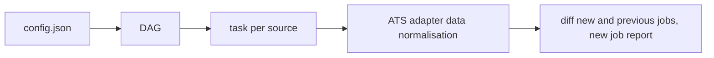

[](https://github.com/Muckds89/job-monitor/actions/workflows/tests.yml) 

# Overview

Scheduled Airflow pipeline that polls applicant tracking system APIs and reports new job postings

# Domain

**ATS** - ATS stands for Application Tracking System, a service widely use today to manage, process and aquire applications for job posts

# Tech Stack

- **Airflow** a pipeline orchestration stack which allows to monitor, concatenate and organise tasks (DAGS) in a orderly manner thanks to a master process represanted by the **DAG definition file** combined with **Dynamic Task Mapping** (`.expand()`).
- **ASTRO CLI**
- **Docker**
- **Python**

More Info at (https://github.com/Muckds89/job-monitor/Notes.md)


# How it works

## Diagram

## Overview
- config.json is a list of dictionary, each dictionary contains a company info (company name, ats type, ats url)
- Airflow dinamically istantiates independend Task Insytances for each parameter (one per company) through the the **DAG definition file** combined with **Dynamic Task Mapping** (`.expand()`)
- Each ATS has calls its one specific ATS adapter to normalise the data
- A diff operation is performed to retrieve the job not present in the previous run, and a report is created if any new job is founds 


# Project structure

# Run it locally

# Run the tests

## Install only development dependencies (without airflow)

```bash
pip install -r requirements-dev.txt
python -m pytest --ignore=tests/dags
```

# Adding a source

- **First step** in include/config.json append a new company dictionary to the "companies" list of dictionaries, for example:
```json
 {
    "company": "IQGeo",
    "api_url": "https://iqgeo.bamboohr.com/careers/list",
    "ats": "bamboohr"
}
```
- **Second step** build an adapter .py file to normalise the response from the ATS in include/sources

- **Third step** write a test in tests/ and test it with pytest manually. Also ther eis an automated CI workflow that triggers for every push/pull_request.

# Design decisions


# Status/ Next steps

In progress